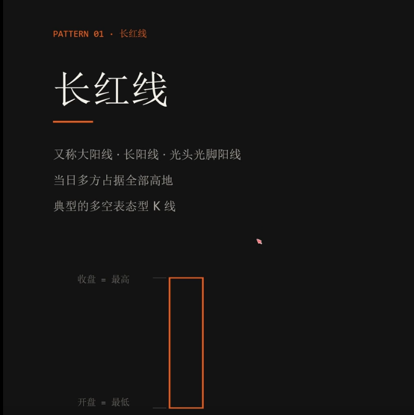
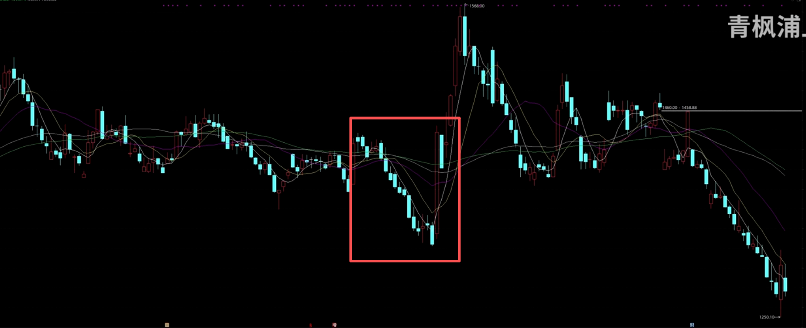
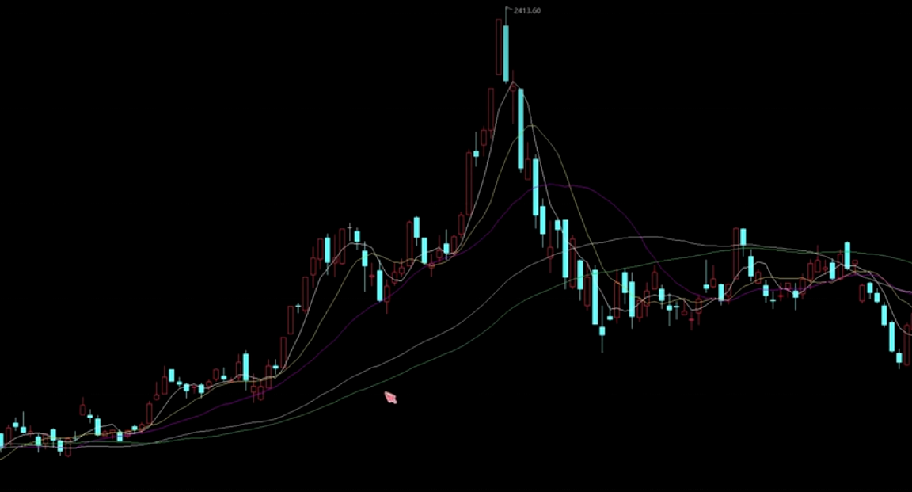
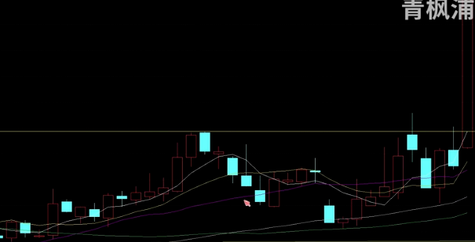

# 长红线

牛市看长红。长红代表了多方的绝对优势

牛市有一句话，叫不见长红不回头。同一根长红，在出现的位置不同，含义也不同。

## 低档长红

在一段长时间的下跌之后（5-10个交易日，个股下跌累计15%，指数下跌5%），突然出现的长红线。往往是多方进攻的启动反攻的信号。

在下跌过程中，量能不断缩小，换手变低，长时间下跌割肉的都走了，大部分散户套牢。此时大资金入场，全天不断的从头到尾都在买入，卖压全部释放，明牌看多。

形态出现+量能配合，来确定低档长红，低档长红就是买入的信号，跌的越久，上涨高度越高。

## 高档长红

经历过一段长时间的上涨后，突然出现的长红线，往往是多头耗尽的警告。

形态出现+量能配合，来确定高档长红，高档长红就是卖出的信号，高度越高越可怕。

因为长红必然代表了看涨资金，踏空资金涌入。高档长红代表了市场上最后一批看多的和最后一批踏空的全部涌进来的瞬间。如果场外的多头资金都进场了，那么谁来拉升呢？

而且往往高档长红还会配合高开的跳空缺口不回踩。代表市场对这个股票的预期极度乐观，所有人都把资金投入进去。意味着顶出现了。

不见长红不回头，在强势上涨行情中，看见高档长红才是卖出的信号。也许高档长红并不会立刻见顶，但是看到这个信号，往往是警告。越涨越卖。不需要一次性清仓，一定要减仓，绝对不能加仓。

## 箱体突破长红

箱体突破长红是进一步拉升的信号。

股价在一段时间保持了一个箱体，向上有顶部压制，向下有底部支撑。多空双方在这个箱体间不断博弈。

最终有一天，突然放量，突破了一根长红线，代表了多方在这个箱体间取得了绝对性的胜利。
那么原本被压制在箱体内的能量将会一次性的释放出来，这就是一个新的看多信号。告诉你盘整结束了。

但是必须要放量突破，并且是成交量比盘整期的平均成交量更大的话，代表了大概率是真实突破

但如果是缩量突破，并且成交量反而比平均成交量更小的话，很有可能是假突破。没有量的突破，没有完全释放空方。很可能就是一个假突破，很快股价就会跌回到下方。

因此长红突破的第一个信号就是看量。

一般上涨的高度和箱体的长度是差不多的。

可以通过箱体的上下沿来判断上涨的高度。例如下沿84，上沿94，中间的高度差是10。那么最终调整的高度可能就在是94+10=104

如果在第一波箱体上涨到目标价后，经过盘整又开启了一波上涨，那么就可以把k线缩小，放大箱体的范围，用同样的方法去观察更大的箱体，判断大概的上涨高度。

## 长红跌破

如果长红被跌破，那必须要注意风险。

因为一根长红就代表了当天所有人的买入成本。只要股价依旧在这个长红的上方，这个长红就是强力支撑。因为股价没有跌破他们的成本，他们就有持有的信息。

一旦股价跌破了长红线，意味着所有的人都亏损了。要么是套住等解套，要么是割肉。

因此一旦长红被跌破，往往代表了下跌加速开始。

因此一根长红的中线是警戒点，是第一道防线，如果跌长红中线，就要减仓，如果跌破了长红底部，必须清仓。

这就是交易纪律，必须买入确定性。不能博弈

