头一个小时，引导一个交易日。所以只看开盘和收盘一小时，其余都是垃圾时间。

# 实体线

# 纺锤线

# 伞形线/锤子线/上吊线

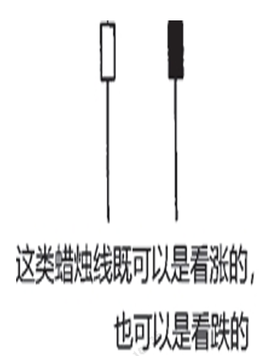

根据三个方面区分锤子线和上吊线

1. 实体处于整个价格的上端，但实体本身的颜色无所谓
2. 带有长下影线，且下影线的长度至少达到实体高度的2倍
3. 没有上影线或者上影线极短

伞形线的下影线越长，上影线越短，实体越小，就越有意义

一半来说，在顶部的上吊线意味着上涨趋势的结束，底部的锤子线意味着下跌趋势的结束

但是具体还需要通过趋势，K线出现前后的运动区间，验证信号来区分。

## 锤子线

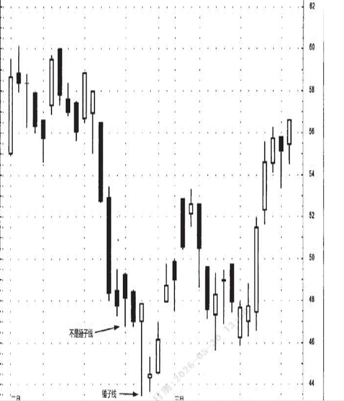

锤子线既可以是阴线，也可以是阳线。带有长下影线并收于本日最高价。意味着市场曾剧烈下跌，后来却完全反弹上来。这就是下跌趋势的底部反转信号。

当锤子线出现时，不必急于入场，锤子线代表了潜在的支撑。当振幅过大时，有时在回调到锤子线下影线范围后是更好的入场机会。（大多数情况是不回调的，也可以在确认不回调后入场）

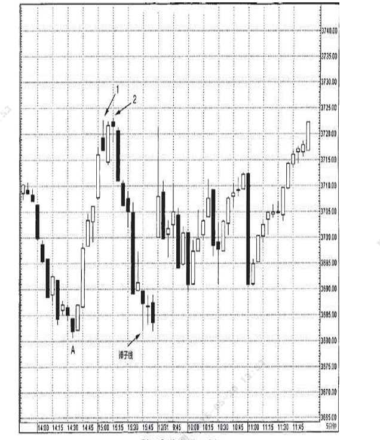

在锤子线形成后，往往作为底部支撑存在。若跌破锤子线很多，则代表底部支撑失效了。

## 上吊线

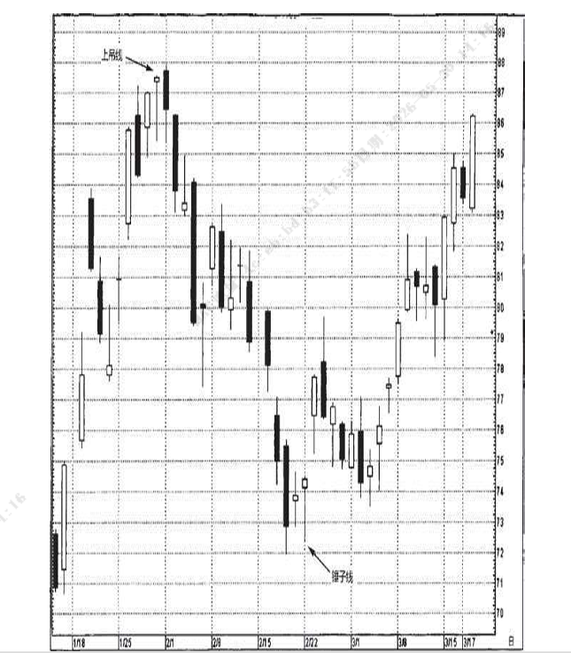

上吊线往往是见顶信号，不过需要搭配后续信号一起使用，当次日的收盘价低于上吊线时，往往是下跌的开始。因为这意味今日冲高量能不足。且所有在上吊线收盘价买入的人都是亏损状态。
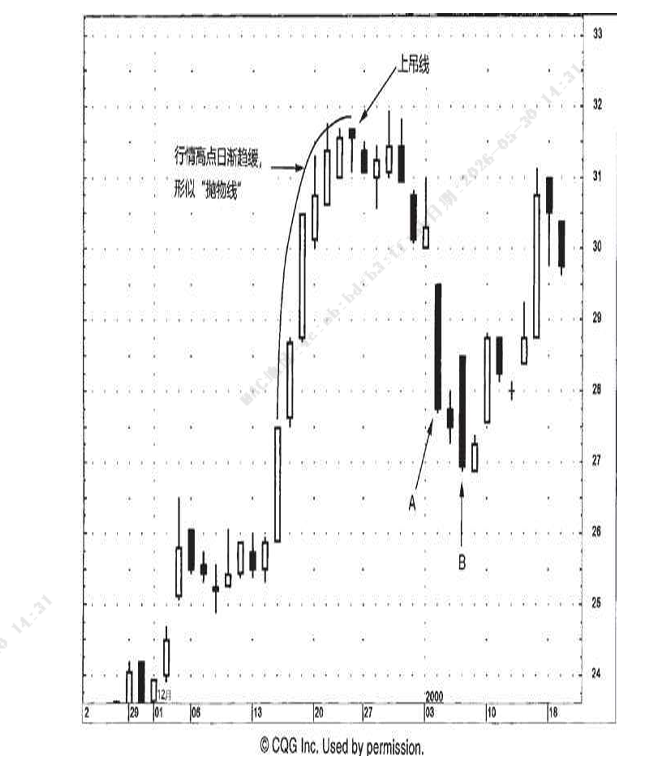

以此图为例，在经过一段箱体整理后，股价强势向上突破，每一根开盘价都接近当日的最低点。收市价接近最高点。意味着多头主导行情，但是后续出现了若干的警告信号：上升曲率逐渐放缓，k线出现了很多上影线，随后出现了一根上吊线。在后续的行情中也是冲高失败，最后被一根阴线吞没开启下跌行情。

而在AB两个大实体出现后都跟随了小实体，说明空方并未完全占据主导力量。
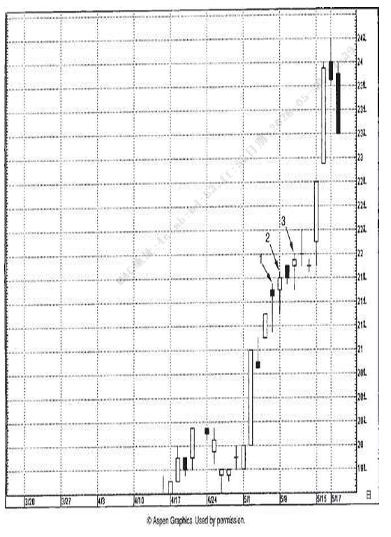

该图说明了即使出现上吊线，等待信号也更重要。图中1，2，3都是上吊线，但每一根上吊线都创了新高，延续了上涨的动能。因此即使是收盘买入的多头也是盈利的。后续也开启了一波涨势。

# 吞没形态

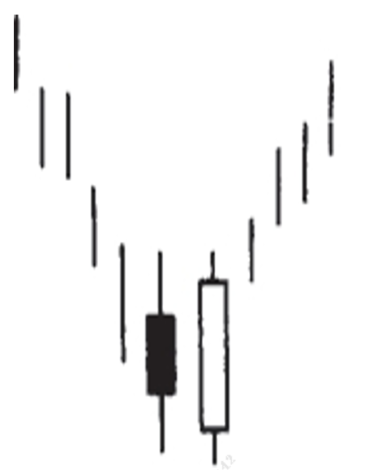
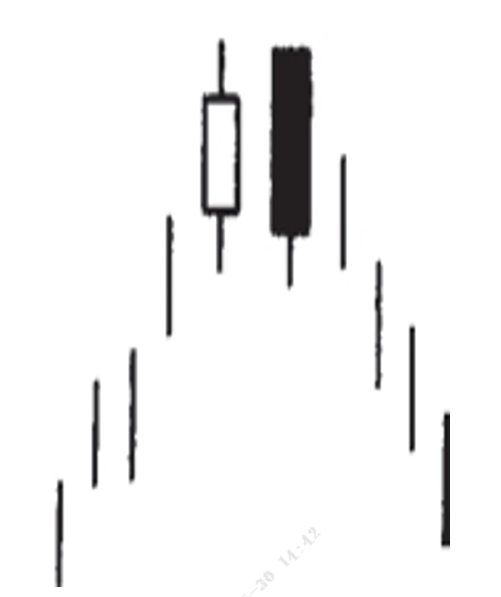

吞没形态有三条标准：
1. 在吞没形态之前，市场必须处于明确的上升或下降趋势，哪怕只是短期的。（横盘不算）
2. 吞没形态由两条蜡烛线组成，其中第二根蜡烛线的实体必须覆盖第一根蜡烛线的实体（实体吞没，但是不一定要吞没上下影线）
3. 第二个实体的颜色必须与第一个实体的颜色相反（也就是阳包阴或阴包阳，但是也有例外，比如第一天收顶部十字星，第二天收相同颜色的实体）

吞没形态分为看涨吞没形态——下跌趋势中的阳包阴
看跌吞没形态——上涨趋势中的阴包阳

如果满足下列要素，那么吞没形态作为反转信号的可能性将大大增强：

1. 第一根实体非常小（收纺锤线），而第二天的实体非常大。第一天小实体反映出原有趋势的驱动力量正在消退。而第二天吞没的实体证明了反向的力量正在增加。
2. 如果吞没形态出现在非常快速的拉升或下跌趋势中，或者是超卖超买区间，往往是变盘信号。
3. 如果第二实体存在超额的交易量，需要按量分析

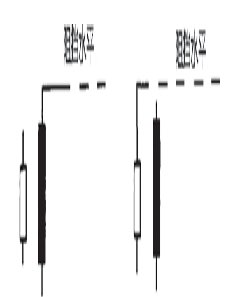

吞没形态的主要作用就是构成支撑水平和阻挡水平。根据是底部还是顶部出现的位置，用二者中的最长的影线构成支撑或阻挡。

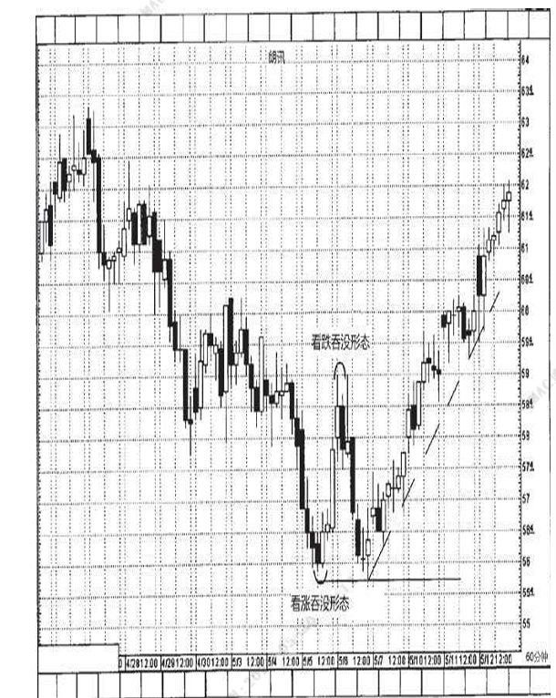

如图所示，在连续的极端迅速的阴线下跌后，出现了一根阳线吞没形态，这是看涨信号，后续股价迅速完成了反转，而该形态的下影线就是底部支撑。在后续的快速上涨后，又在顶部出现了看跌吞没形态。股价迅速回落到底部，并以吞没形态的下影线为支撑。在底部形成了十字星，随后沿着向上倾斜的支撑线迎来了一波上涨。
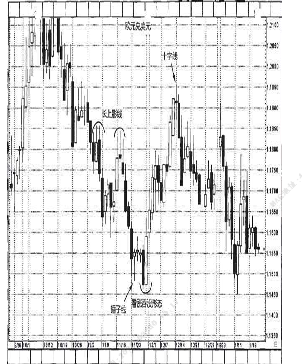

在这个例子中，下跌通道中出现了一系列的长上影线，下跌中的长上影横盘，没有上涨信号和变盘信号，往往要继续下跌。最后在底部的出现了一个锤子线。确定了底部反转信号。在后续的下跌中，出现了一根大阴线稍微突破了锤子线的底部支撑，随后就出现了一根大阳线看涨吞没，开启了新一轮的上涨行情。最后在高位放量长阳后，收了一根十字星，正好验证了上一轮的顶部上影线。无法突破阻挡。在次日出现下跌吞没，开启下跌行情。

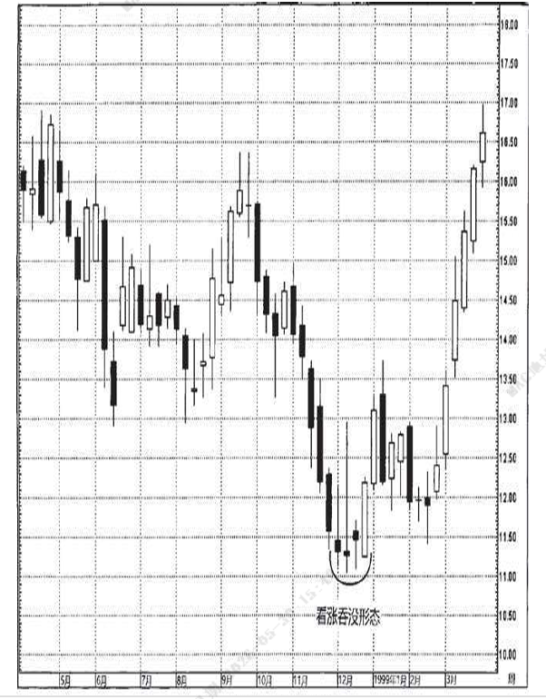

在这个例子中，底部开始出现小黑色实体，吞没形态出现一根光头光脚长阳线。出现一阳包三阴，说明多头已经完全取得控制权。随后迎来一波强势上涨。

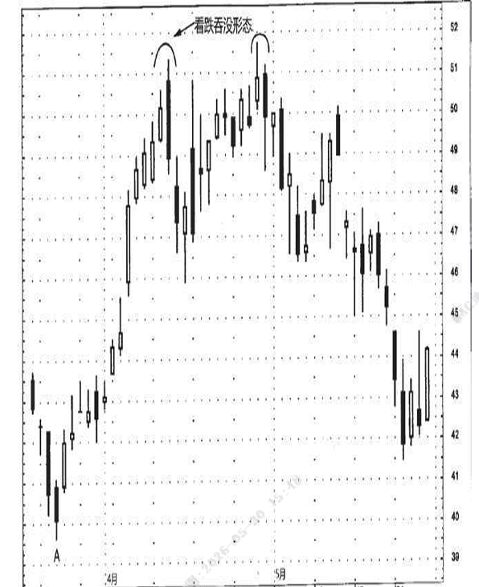
这个例子在底部启动后，顶部出现连续的上影线，以及顶部吞没形态。并且两次尝试突破阻拦都出现看跌吞没形态，表明多头已无力主导行情。

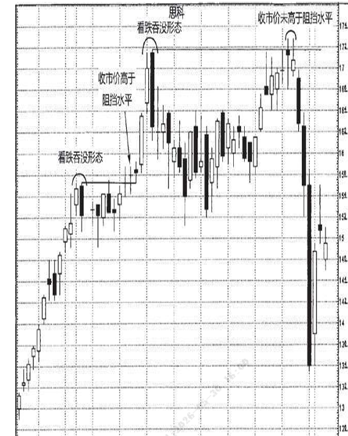

在这个案例中，第一个看跌吞没形态取代了之前的强势上涨行情，股价随之不在强势上涨。然而在高位经过一段时间的盘整之后，股价逐步向上突破了吞没形态的阻拦最高点。便成为看涨信号。尽管是十字星，但是当日股价创下历史新高，依然是正面信号。只有在日内收盘价依然维持突破新高，才能看作一个强势上涨的突破信号。7月21日，股价在高点出现看跌吞没形态。又开始下跌，而在箱体整理之后冲击高点，依然未能高于阻挡水平，并且阳线只是一群小实体，说明了市场在此处的犹豫心理。形成双顶，此后股价开始下跌。

# 为什么要根据K线设置保护性止损

很多人在短暂的下跌中不愿意止损，一厢情愿的希望市场转向对自己有利的方向。
永远记住两点：
1. 所有的长期趋势都是从短期运动开始的
2. 市场根本不给任何主观愿望留有余地

巴菲特有两条座右铭：
1. 保住本金
2. 绝不忘记第一条

留得青山在，不怕没柴烧。永远记住保住本金和筹码，才能寻找到更好的机会再来。

# 乌云盖顶

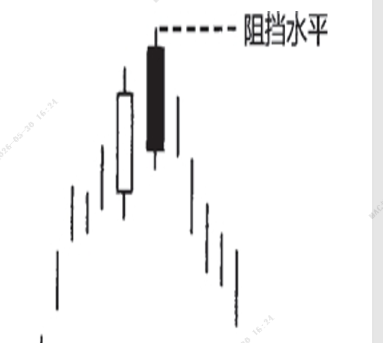

乌云盖顶是一种顶部反转形态，出现在上升趋势中。某些情况下也会出现在水平调整空间的顶部。

乌云盖顶形态的的特征：

1. 第一天是一根坚挺的白色实体；第二天的开市价超过了第一天的最高价（超过了第一天上影线的顶端），但是到了第二天收市的时候，市场却收市在接近当日最低价的水平，并且明显地向下扎入第一天阳线实体的内部。
2. 第二天的阴线扎穿阳线的程度越深，构成顶部反转的可能性越大（特别以中点为区分，扎穿中点下方意味着50%的获利盘都亏损了）

如果乌云盖顶形态并没有穿过阳线的实体中点，那么可以等待一日看看是否有进一步的看跌信号。(适度减仓控制回撤)

如果出现了以下特种，则更有技术分量，反转的可能更大：

1. 阴线的收盘价向下扎入阳线的程度越深，构成顶部的可能越大。如果完全吞没就是吞没形态。
2. 如果乌云盖顶形态发生在一段超长程的上升趋势中，并且前一天是大阳线，而次日就是大阴线
3. 如果阴线的开盘价高于某个之前出现过的顶部阻挡，但是市场未能成功守住然后造成了下跌，那么可能多头已经无力控制市场
4. 如果乌云盖顶之后，次日依然爆量买入，股价新高，成交量极大，说明最后一批新买家也乘着回调上船了。是一种危险的警告信号。

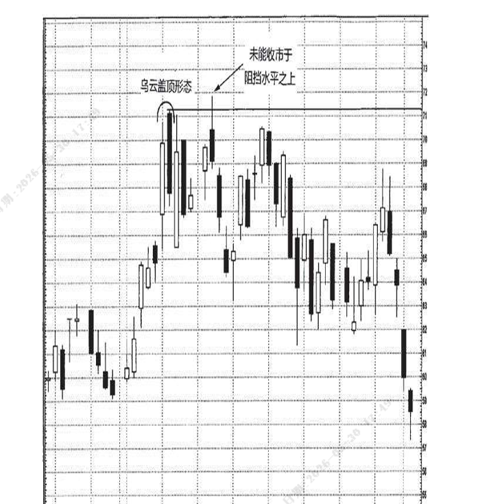

乌云盖顶和上涨吞没形态都是看跌的技术形态，都构成行情高度的阻挡水平。然而一旦接下来有个大阳线突破这一看跌形态，突破了高度限制，则可能意味着新一轮行情的到来。反之若突破前高却无法站稳，则是强烈的看空信号。

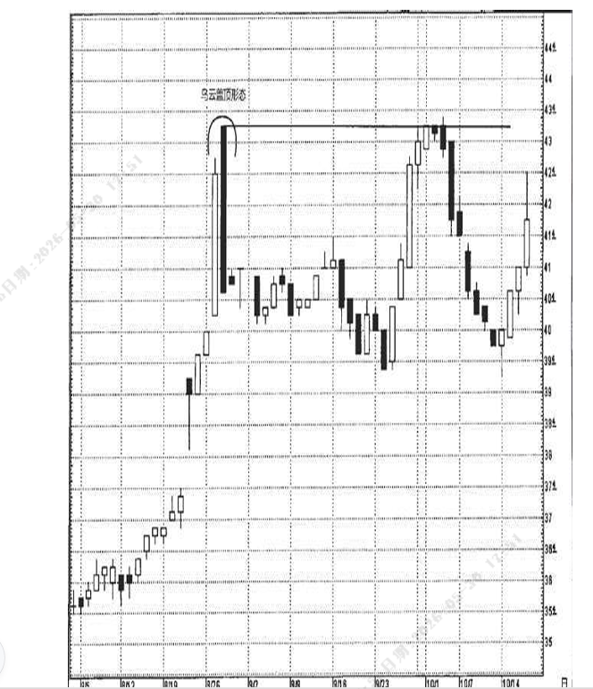

途中的股价在22号出现了一个跳空的上吊线，本来是下跌的反转趋势预兆。然而次日的确认中，股价依然延续强势。突破了阻拦。证明了新一轮的强势上涨。在最后一根长阳线出现，次日出现了乌云盖顶并几乎扎穿了阳线。但是仅2个交易日就出现了锤子线，在后续的横盘整理后又走出了一波上涨行情。但是到最后的前高位置出现的小实体证明了市场的犹豫，随后股价未能突破前高，又出现了吞没形态。股价再度下跌。

在这个例子中，犹豫股价大幅下跌，进入超跌范围，距离关键的阻力位置过远。可能迎来反弹。所以认为不是卖出的好时候。（也是由于涨幅跌幅过大，明显是龙头，参与度也会更高）