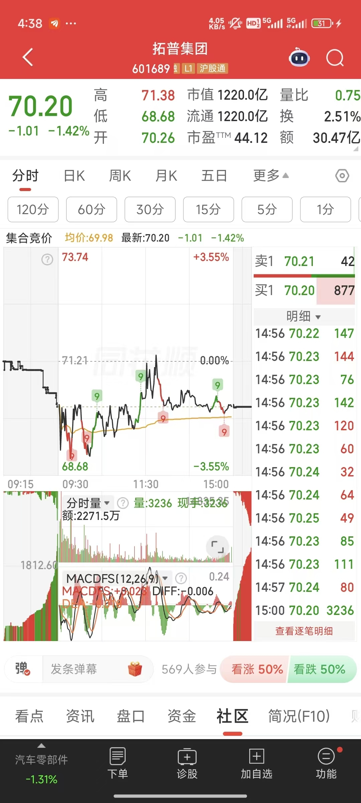
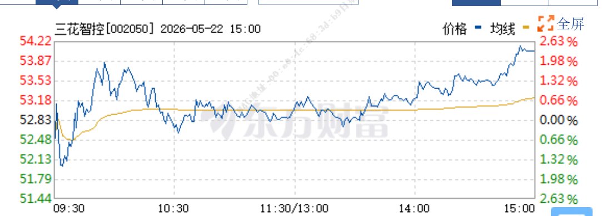
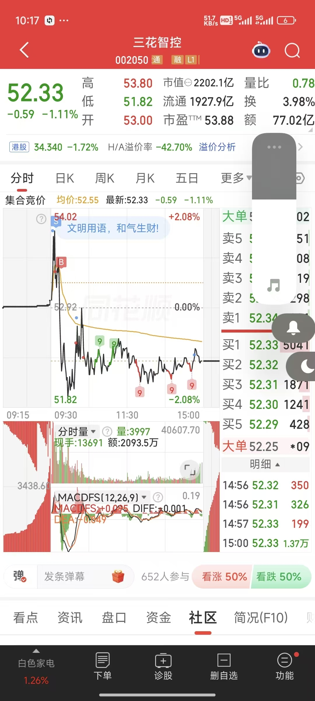

# 盘前操作

## 看盘前消息

每日盘前注意消息面，结合股价判断消息是真正的利好还是出货，是否存在持续性。每日消息从以下几个方面来分析：主线相关性，持续性，确定性，权威性

例如某日首个国产车规级芯片消息利好，当日长盈精密午盘拉升到8个点，若早盘卖出则踏空。但本身此消息并非长盈精密核心催化，且并不存在持续性，因此午盘卖出，尾盘买入做T最佳。

5月22日盘前消息，四方达老板接受央视采访，直言目前金刚石产能完全不够用。金刚石是英伟达产线核心原料之一，踩在AI，芯片科技大主线，因此存在一定持续性，可持续1-3日，且央视站台权威性高，当日四方达从3%涨到20%封板。

5月22日盘前消息，京东方因与康宁合作，21日一字封板。21日大盘跳水暴跌。22日盘前京东方发布公告，合作未到兑现期，在26-27年执行。看似利空，但是实则证明了合作消息属实，存在大订单的确定性以及美国巨头对公司核心技术的认可性，早盘因21日跳水叠加消息面利空，恐慌下杀到5日线。可入场抄底，最终随着大盘进入强修复，情绪回升尾盘封板。玻璃基板作为核心材料，在已有明确的订单前提的情况下，主线相关性高，对于公司而言订单明确，持续性较强，未来业绩增长曲线的确定性高，权威性高，可入场。

## 看大盘情绪

盘前集合竞价主要查看大盘板块情绪，若板块竞价情绪较好，则大概率开盘会上冲。若诸多热门板块竞价情绪较差叠加大盘情绪差，则需要小心。需分析是否有实质性利空选择抄底还是减仓。

## 看股吧热帖

股吧热帖可作为消息来源参考渠道，优势是长期持股该股票的股民更容易找到相关利好，且股民情绪可作为反向参考指标。所有的消息都应当用操作笔记理性分析，不应被情绪裹挟。散户是你的对手盘，任何散户其做空概率远远大于做多，散户始终是不可信任的。

# 盘中操作

## 做T

盘中不建议再买入什么股票了。买入时机只有开盘和尾盘。盘中最适合的是做T。做T目前我的理解是，判断当前股票的走势类型，我分为三种：强势分时，弱势分时，多空平衡分时

如果是上涨趋势，多为强势分时和多空平衡分时，若有利空，有可能转为弱势分时，若长期趋势不变，弱势分时适宜加仓。

多空平衡分时下，股价围绕均线上下波动。均线上方任意点作为卖点，下方任意点作为买点都是正确的

强势分时下，股价大部分时间位于均线上方，此时股票在远离均线处卖，靠近均线处买

弱势分时下，股价大部分时间位于均线下方，此时股票在远离均线处买，靠近均线处卖

## ETF战法

若因错过盘前消息导致踏空，也不要紧。部分强势板块因重大利好集体封板，此时可以买入板块ETF。盘中买入需要观察大盘情绪，若大盘情绪低迷，板块内非封板个股下跌会导致板块整体指数下跌，买入容易亏损。若大盘情绪高涨，可以盘中买入获取额外收益。大盘情绪高涨时，当日买入，次日开盘大概率有涨停板的高溢价，可开盘直接卖出。该战法适合大盘情绪较好时买入。
